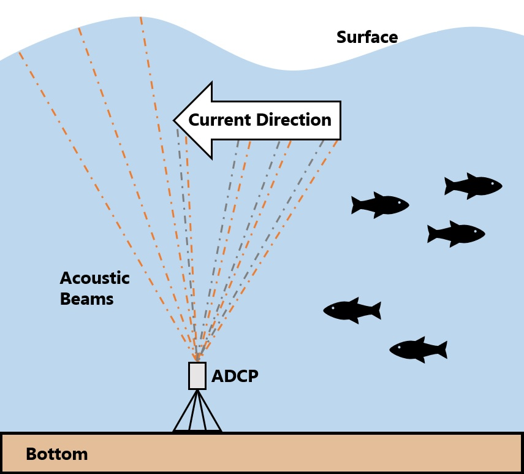
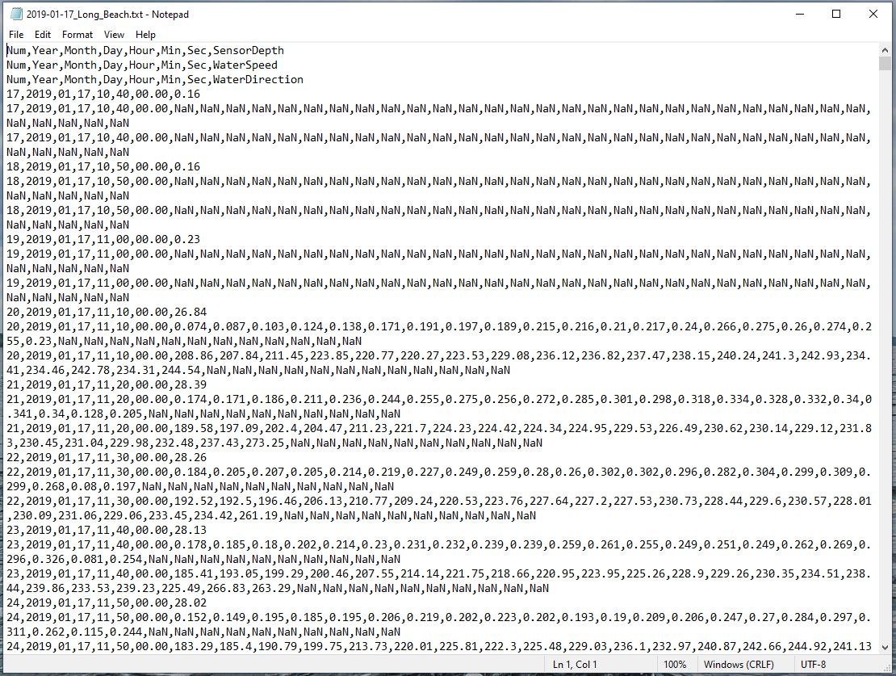

<!-- README.md is generated from README.Rmd. Please edit that file -->

```{r, include = FALSE}
knitr::opts_chunk$set(
  collapse = TRUE,
  comment = "#>",
  fig.path = "man/figures/README-",
  out.width = "100%"
)

library(badger)

repo <- "dempsey-CMAR/adcp"
```

# adcp: README

```{r, echo=FALSE, out.width="30%", fig.align='center'}


```


<!-- badges: start -->

[](https://www.gnu.org/licenses/gpl-3.0) `r badge_devel(repo, "blue")` `r badge_codefactor(repo)` `r badge_github_actions(repo)`

<!-- badges: end -->

Format and visualize Current data collect by Acoustic Current Doppler Profilers (ADCPs).

## Installation

You can install the development version of adcp from [GitHub](https://github.com/) with:

``` r
# install.packages("devtools")
devtools::install_github("dempsey-CMAR/adcp")
```

## Background

The Centre for Marine Applied Research ([CMAR](https://cmar.ca/)) coordinates an extensive [Coastal Monitoring Program](https://cmar.ca/coastal-monitoring-program/) to measure [Essential Ocean Variables](https://www.goosocean.org/index.php?option=com_content&view=article&id=14&Itemid=114) from around the coast of Nova Scotia, Canada. There are three main branches of the program: _Water Quality_, _Currents_, and _Waves_. Processed data for each branch can be viewed and downloaded from several sources, as outlined in the [CMAR Report & Data Access Cheat Sheet](https://github.com/Centre-for-Marine-Applied-Research/strings/blob/master/man/figures/README-access-cheatsheet.pdf) (download for clickable links).

The `adcp` package is used to format and visualize data from the _Current_ branch of the Coastal Monitoring Program. 

_Current_ data is collected with Acoustic Doppler Current Profilers (ADCPs) deployed on the seafloor. An ADCP is a hydroacoustic current meter that measures water velocities over a range of depths. These sensors measure soundwaves scattered back from moving particles in the water column and use the Doppler effect to estimate speed and direction (Figure 1). 


```{r, echo=FALSE, out.width="65%", fig.align='center'}



```
<br>
Figure 1: ADCP diagram (not to scale).

<br>
<br>


Current data is recorded for vertical bins throughout the water column. The `adcp` package uses data from the sensor configuration to calculate the bin height above sea floor and the bin depth below the surface (Figure 2). Note that the *bin height* always refers to the same point in space; the same *bin depth* can refer to different points due to changing tides.


```{r, echo=FALSE}

knitr::include_graphics("man/figures/README-fig2.png")

```
Figure 2: The bin height above the sea floor and the bin depth below the surface are calculated from deployment configurations including the sensor depth, sensor height above the sea floor, first bin range, and bin size.


## Example

```{r message=FALSE}
library(adcp)
library(dplyr)
library(viridis)
```


Consider an ADCP deployed from January 17, 2019 to March 1, 2019 at Long Beach, St. Mary's Bay. 

The raw .txt file looks like this:


```{r, echo=FALSE, fig.align='center'}



```
Figure 3: Raw ADCP data file for Long Beach.

### Import and format data

`adcp_read_txt` reads in the .txt file and applies some formatting. There is a column for the timestamp, ensemble number, and variable measured. Additional columns, labelled `V8` to `Vn` hold the measurements for each bin.

```{r}

path <- system.file("testdata", package = "adcp")

# deployment metadata from tracking sheet
metadata <- tibble(
  Depl_ID = "DG009",
  Waterbody = "St. Mary's Bay",
  Station_Name = "Long Beach",
  Inst_Altitude = 0.5,
  Bin_Size = 1,
  First_Bin_Range = 1
)


dat <- adcp_read_txt(path, "2019-01-17_Long_Beach.txt")

head(dat)

```
`adcp_assign_bin_altitude()` re-names the bin columns with the corresponding bin altitude (height above the sea floor), using information from the deployment configuration.

```{r}
dat <- adcp_assign_altitude(dat, metadata = metadata)

head(dat[, 1:10])
```
The centre of the first bin is 1.5 m from the sea floor; the centre of the second bin is 2.5 m from the sea floor, etc.

`adcp_correct_timestamp()` converts the timestamp to UTC.


The timestamp column of the raw data is in the timezone of the deployment date (e.g., "AST" if deployed in November to March and "DST" if deployed in March to November). The timestamp does NOT account for changes in daylight savings time.

adcp_correct_timestamp() converts each timestamp to true UTC by adding 3 hours if the deployment date was during daylight savings, or 4 hours if the deployment date was during Atlantic Standard Time.

```{r}
dat <- adcp_correct_timestamp(dat)

head(dat[1:10])
```
This ADCP was deployed in January (AST), so 4 hours were added to each timestmap to convert to UTC.


`adcp_pivot_longer()` pivots the data so that bin heights are observations, and adds [Climate Forecast-compliant](https://cfconventions.org/Data/cf-standard-names/current/build/cf-standard-name-table.html) names to each column.

```{r}
dat <- adcp_pivot_longer(dat)

head(dat)
```
`dat` is now in a useful format for analysis. 

However, for submission to the [Nova Scotia Open Data Portal](https://data.novascotia.ca/), several additional steps are required.

`adcp_calculate_bin_depth()` adds column `bin_depth_below_surface_m`:

```{r}
dat <- adcp_calculate_bin_depth(dat, metadata = metadata)

head(dat)
```
`adcp_add_opendata_cols()` adds `deployment_id`, `waterbody`, and `station` columns so the data can be compiled with other deployments.

```{r}
dat <- adcp_add_opendata_cols(dat, metadata = metadata)

head(dat)
```
`adcp_flag_data()` flags obervations where `sensor_depth_below_surface_m` changes faster than expected.

```{r}
dat <- adcp_flag_data(dat)

head(dat[, 6:11])
```

All of these steps can be linked using the pipe operator:

```{r}
dat <- adcp_read_txt(path, "2019-01-17_Long_Beach.txt") %>% 
  adcp_assign_altitude(metadata) %>%
  adcp_correct_timestamp() %>%
  adcp_pivot_longer() %>%
  adcp_calculate_bin_depth(metadata) %>%
  adcp_add_opendata_cols(metadata) %>%
  adcp_flag_data()

head(dat)
```


### Plot data

Plot the sensor depth to determine if any observations should be trimmed.
```{r, fig4, fig.height=3.5, dpi=600}
adcp_plot_depth_flags(dat)
```
Filter data to keep "good" obsevations.
```{r}
dat <- filter(dat, depth_flag == "good")
```

Plot sensor depth:

```{r, fig5, fig.height=3.5, dpi=600}
adcp_plot_depth(dat, geom = "line")

```
Plot current rose:
```{r, fig6, fig.height=3.5, dpi=600}

cols <- viridis(12, option = "F", direction = -1)

ints <- adcp_count_obs(dat, sea_water_speed_m_s)
breaks <- c(ints$lower, max(ints$upper)) 


adcp_plot_current_rose(
  dat, 
  breaks = breaks, 
  speed_cols = cols,
  speed_label = "Current Speed (m/s)"
)

```
Plot current speed histogram.
```{r, fig7, fig.height=3.5, dpi=600}
 adcp_plot_speed_hist(ints, bar_cols = cols, speed_label = "Current Speed (m/s)")
```


