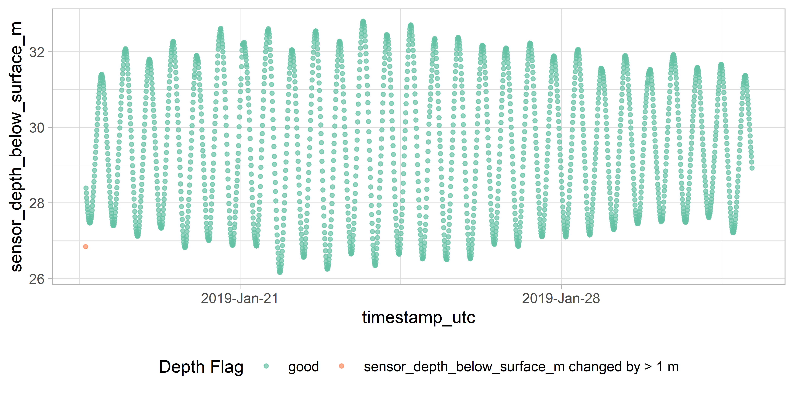

<!-- README.md is generated from README.Rmd. Please edit that file -->

# adcp: README


<!-- badges: start -->

[](https://www.gnu.org/licenses/gpl-3.0)
[](https://github.com/dempsey-CMAR/adcp)
[](https://www.codefactor.io/repository/github/dempsey-CMAR/adcp)
[](https://github.com/dempsey-CMAR/adcp/actions)

<!-- badges: end -->

Format and visualize Current data collect by Acoustic Current Doppler
Profilers (ADCPs).

## Installation

You can install the development version of adcp from
[GitHub](https://github.com/) with:

``` r
# install.packages("devtools")
devtools::install_github("dempsey-CMAR/adcp")
```

## Background

The Centre for Marine Applied Research ([CMAR](https://cmar.ca/))
coordinates an extensive [Coastal Monitoring
Program](https://cmar.ca/coastal-monitoring-program/) to measure
[Essential Ocean
Variables](https://www.goosocean.org/index.php?option=com_content&view=article&id=14&Itemid=114)
from around the coast of Nova Scotia, Canada. There are three main
branches of the program: *Water Quality*, *Currents*, and *Waves*.
Processed data for each branch can be viewed and downloaded from several
sources, as outlined in the [CMAR Report & Data Access Cheat
Sheet](https://github.com/Centre-for-Marine-Applied-Research/strings/blob/master/man/figures/README-access-cheatsheet.pdf)
(download for clickable links).

The `adcp` package is used to format and visualize data from the
*Current* branch of the Coastal Monitoring Program.

*Current* data is collected with Acoustic Doppler Current Profilers
(ADCPs) deployed on the seafloor. An ADCP is a hydroacoustic current
meter that measures water velocities over a range of depths. These
sensors measure soundwaves scattered back from moving particles in the
water column and use the Doppler effect to estimate speed and direction
(Figure 1).


<br> Figure 1: ADCP diagram (not to scale).

<br> <br>

Current data is recorded for vertical bins throughout the water column.
The `adcp` package uses data from the sensor configuration to calculate
the bin height above sea floor and the bin depth below the surface
(Figure 2). Note that the *bin height* always refers to the same point
in space; the same *bin depth* can refer to different points due to
changing tides.

 Figure 2: The bin
height above the sea floor and the bin depth below the surface are
calculated from deployment configurations including the sensor depth,
sensor height above the sea floor, first bin range, and bin size.

## Example

``` r
library(adcp)
library(dplyr)
library(viridis)
```

Consider an ADCP deployed from January 17, 2019 to March 1, 2019 at Long
Beach, St. Mary’s Bay.

The raw .txt file looks like this:


Figure 3: Raw ADCP data file for Long Beach.

### Import and format data

`adcp_read_txt` reads in the .txt file and applies some formatting.
There is a column for the timestamp, ensemble number, and variable
measured. Additional columns, labelled `V8` to `Vn` hold the
measurements for each bin.

``` r
path <- system.file("testdata", package = "adcp")

# deployment metadata from tracking sheet
metadata <- tibble(
  Depl_ID = "DG009",
  Waterbody = "St. Mary's Bay",
  Station_Name = "Long Beach",
  Inst_Altitude = 0.5,
  Bin_Size = 1,
  First_Bin_Range = 1
)


dat <- adcp_read_txt(path, "2019-01-17_Long_Beach.txt")

head(dat)
#>          timestamp_ns Num       variable   V8 V9 V10 V11 V12 V13 V14 V15 V16
#> 1 2019-01-17 10:40:00  17    SensorDepth 0.16 NA  NA  NA  NA  NA  NA  NA  NA
#> 2 2019-01-17 10:40:00  17     WaterSpeed   NA NA  NA  NA  NA  NA  NA  NA  NA
#> 3 2019-01-17 10:40:00  17 WaterDirection   NA NA  NA  NA  NA  NA  NA  NA  NA
#> 4 2019-01-17 10:50:00  18    SensorDepth 0.16 NA  NA  NA  NA  NA  NA  NA  NA
#> 5 2019-01-17 10:50:00  18     WaterSpeed   NA NA  NA  NA  NA  NA  NA  NA  NA
#> 6 2019-01-17 10:50:00  18 WaterDirection   NA NA  NA  NA  NA  NA  NA  NA  NA
#>   V17 V18 V19 V20 V21 V22 V23 V24 V25 V26 V27 V28 V29 V30 V31 V32 V33 V34 V35
#> 1  NA  NA  NA  NA  NA  NA  NA  NA  NA  NA  NA  NA  NA  NA  NA  NA  NA  NA  NA
#> 2  NA  NA  NA  NA  NA  NA  NA  NA  NA  NA  NA  NA  NA  NA  NA  NA  NA  NA  NA
#> 3  NA  NA  NA  NA  NA  NA  NA  NA  NA  NA  NA  NA  NA  NA  NA  NA  NA  NA  NA
#> 4  NA  NA  NA  NA  NA  NA  NA  NA  NA  NA  NA  NA  NA  NA  NA  NA  NA  NA  NA
#> 5  NA  NA  NA  NA  NA  NA  NA  NA  NA  NA  NA  NA  NA  NA  NA  NA  NA  NA  NA
#> 6  NA  NA  NA  NA  NA  NA  NA  NA  NA  NA  NA  NA  NA  NA  NA  NA  NA  NA  NA
#>   V36 V37 V38 V39 V40 V41 V42 V43 V44 V45 V46 V47 V48 V49 V50 V51 V52 V53 V54
#> 1  NA  NA  NA  NA  NA  NA  NA  NA  NA  NA  NA  NA  NA  NA  NA  NA  NA  NA  NA
#> 2  NA  NA  NA  NA  NA  NA  NA  NA  NA  NA  NA  NA  NA  NA  NA  NA  NA  NA  NA
#> 3  NA  NA  NA  NA  NA  NA  NA  NA  NA  NA  NA  NA  NA  NA  NA  NA  NA  NA  NA
#> 4  NA  NA  NA  NA  NA  NA  NA  NA  NA  NA  NA  NA  NA  NA  NA  NA  NA  NA  NA
#> 5  NA  NA  NA  NA  NA  NA  NA  NA  NA  NA  NA  NA  NA  NA  NA  NA  NA  NA  NA
#> 6  NA  NA  NA  NA  NA  NA  NA  NA  NA  NA  NA  NA  NA  NA  NA  NA  NA  NA  NA
#>   V55 V56 V57 V58 V59 V60 V61 V62 V63 V64 V65 V66
#> 1  NA  NA  NA  NA  NA  NA  NA  NA  NA  NA  NA  NA
#> 2  NA  NA  NA  NA  NA  NA  NA  NA  NA  NA  NA  NA
#> 3  NA  NA  NA  NA  NA  NA  NA  NA  NA  NA  NA  NA
#> 4  NA  NA  NA  NA  NA  NA  NA  NA  NA  NA  NA  NA
#> 5  NA  NA  NA  NA  NA  NA  NA  NA  NA  NA  NA  NA
#> 6  NA  NA  NA  NA  NA  NA  NA  NA  NA  NA  NA  NA
```

`adcp_assign_bin_altitude()` re-names the bin columns with the
corresponding bin altitude (height above the sea floor), using
information from the deployment configuration.

``` r
dat <- adcp_assign_altitude(dat, metadata = metadata)

head(dat[, 1:10])
#>          timestamp_ns Num       variable  1.5 2.5 3.5 4.5 5.5 6.5 7.5
#> 1 2019-01-17 10:40:00  17    SensorDepth 0.16  NA  NA  NA  NA  NA  NA
#> 2 2019-01-17 10:40:00  17     WaterSpeed   NA  NA  NA  NA  NA  NA  NA
#> 3 2019-01-17 10:40:00  17 WaterDirection   NA  NA  NA  NA  NA  NA  NA
#> 4 2019-01-17 10:50:00  18    SensorDepth 0.16  NA  NA  NA  NA  NA  NA
#> 5 2019-01-17 10:50:00  18     WaterSpeed   NA  NA  NA  NA  NA  NA  NA
#> 6 2019-01-17 10:50:00  18 WaterDirection   NA  NA  NA  NA  NA  NA  NA
```

The centre of the first bin is 1.5 m from the sea floor; the centre of
the second bin is 2.5 m from the sea floor, etc.

`adcp_correct_timestamp()` converts the timestamp to UTC.

The timestamp column of the raw data is in the timezone of the
deployment date (e.g., “AST” if deployed in November to March and “DST”
if deployed in March to November). The timestamp does NOT account for
changes in daylight savings time.

adcp_correct_timestamp() converts each timestamp to true UTC by adding 3
hours if the deployment date was during daylight savings, or 4 hours if
the deployment date was during Atlantic Standard Time.

``` r
dat <- adcp_correct_timestamp(dat)

head(dat[1:10])
#>         timestamp_utc Num       variable  1.5 2.5 3.5 4.5 5.5 6.5 7.5
#> 1 2019-01-17 14:40:00  17    SensorDepth 0.16  NA  NA  NA  NA  NA  NA
#> 2 2019-01-17 14:40:00  17     WaterSpeed   NA  NA  NA  NA  NA  NA  NA
#> 3 2019-01-17 14:40:00  17 WaterDirection   NA  NA  NA  NA  NA  NA  NA
#> 4 2019-01-17 14:50:00  18    SensorDepth 0.16  NA  NA  NA  NA  NA  NA
#> 5 2019-01-17 14:50:00  18     WaterSpeed   NA  NA  NA  NA  NA  NA  NA
#> 6 2019-01-17 14:50:00  18 WaterDirection   NA  NA  NA  NA  NA  NA  NA
```

This ADCP was deployed in January (AST), so 4 hours were added to each
timestmap to convert to UTC.

`adcp_pivot_longer()` pivots the data so that bin heights are
observations, and adds [Climate
Forecast-compliant](https://cfconventions.org/Data/cf-standard-names/current/build/cf-standard-name-table.html)
names to each column.

``` r
dat <- adcp_pivot_longer(dat)

head(dat)
#> # A tibble: 6 x 5
#>   timestamp_utc       sensor_depth_below_surface_m bin_height_~1 sea_w~2 sea_w~3
#>   <dttm>                                     <dbl>         <dbl>   <dbl>   <dbl>
#> 1 2019-01-17 15:10:00                         26.8           1.5   0.074    209.
#> 2 2019-01-17 15:10:00                         26.8           2.5   0.087    208.
#> 3 2019-01-17 15:10:00                         26.8           3.5   0.103    211.
#> 4 2019-01-17 15:10:00                         26.8           4.5   0.124    224.
#> 5 2019-01-17 15:10:00                         26.8           5.5   0.138    221.
#> 6 2019-01-17 15:10:00                         26.8           6.5   0.171    220.
#> # ... with abbreviated variable names 1: bin_height_above_sea_floor_m,
#> #   2: sea_water_speed_m_s, 3: sea_water_to_direction_degree
```

`dat` is now in a useful format for analysis.

However, for submission to the [Nova Scotia Open Data
Portal](https://data.novascotia.ca/), several additional steps are
required.

`adcp_calculate_bin_depth()` adds column `bin_depth_below_surface_m`:

``` r
dat <- adcp_calculate_bin_depth(dat, metadata = metadata)

head(dat)
#> # A tibble: 6 x 6
#>   timestamp_utc       sensor_depth_below_surfa~1 bin_d~2 bin_h~3 sea_w~4 sea_w~5
#>   <dttm>                                   <dbl>   <dbl>   <dbl>   <dbl>   <dbl>
#> 1 2019-01-17 15:10:00                       26.8    25.8     1.5   0.074    209.
#> 2 2019-01-17 15:10:00                       26.8    24.8     2.5   0.087    208.
#> 3 2019-01-17 15:10:00                       26.8    23.8     3.5   0.103    211.
#> 4 2019-01-17 15:10:00                       26.8    22.8     4.5   0.124    224.
#> 5 2019-01-17 15:10:00                       26.8    21.8     5.5   0.138    221.
#> 6 2019-01-17 15:10:00                       26.8    20.8     6.5   0.171    220.
#> # ... with abbreviated variable names 1: sensor_depth_below_surface_m,
#> #   2: bin_depth_below_surface_m, 3: bin_height_above_sea_floor_m,
#> #   4: sea_water_speed_m_s, 5: sea_water_to_direction_degree
```

`adcp_add_opendata_cols()` adds `deployment_id`, `waterbody`, and
`station` columns so the data can be compiled with other deployments.

``` r
dat <- adcp_add_opendata_cols(dat, metadata = metadata)

head(dat)
#> # A tibble: 6 x 9
#>   deployme~1 water~2 station timestamp_utc       senso~3 bin_d~4 bin_h~5 sea_w~6
#>   <chr>      <chr>   <chr>   <dttm>                <dbl>   <dbl>   <dbl>   <dbl>
#> 1 DG009      St. Ma~ Long B~ 2019-01-17 15:10:00    26.8    25.8     1.5   0.074
#> 2 DG009      St. Ma~ Long B~ 2019-01-17 15:10:00    26.8    24.8     2.5   0.087
#> 3 DG009      St. Ma~ Long B~ 2019-01-17 15:10:00    26.8    23.8     3.5   0.103
#> 4 DG009      St. Ma~ Long B~ 2019-01-17 15:10:00    26.8    22.8     4.5   0.124
#> 5 DG009      St. Ma~ Long B~ 2019-01-17 15:10:00    26.8    21.8     5.5   0.138
#> 6 DG009      St. Ma~ Long B~ 2019-01-17 15:10:00    26.8    20.8     6.5   0.171
#> # ... with 1 more variable: sea_water_to_direction_degree <dbl>, and
#> #   abbreviated variable names 1: deployment_id, 2: waterbody,
#> #   3: sensor_depth_below_surface_m, 4: bin_depth_below_surface_m,
#> #   5: bin_height_above_sea_floor_m, 6: sea_water_speed_m_s
```

`adcp_flag_data()` flags obervations where
`sensor_depth_below_surface_m` changes faster than expected.

``` r
dat <- adcp_flag_data(dat)

head(dat[, 6:11])
#> # A tibble: 6 x 6
#>   bin_depth_below_surface_m bin_height_above_s~1 sea_w~2 sea_w~3 depth~4 depth~5
#>                       <dbl>                <dbl>   <dbl>   <dbl>   <dbl> <glue> 
#> 1                      25.8                  1.5   0.074    209.    1.55 sensor~
#> 2                      24.8                  2.5   0.087    208.    1.55 sensor~
#> 3                      23.8                  3.5   0.103    211.    1.55 sensor~
#> 4                      22.8                  4.5   0.124    224.    1.55 sensor~
#> 5                      21.8                  5.5   0.138    221.    1.55 sensor~
#> 6                      20.8                  6.5   0.171    220.    1.55 sensor~
#> # ... with abbreviated variable names 1: bin_height_above_sea_floor_m,
#> #   2: sea_water_speed_m_s, 3: sea_water_to_direction_degree, 4: depth_diff,
#> #   5: depth_flag
```

All of these steps can be linked using the pipe operator:

``` r
dat <- adcp_read_txt(path, "2019-01-17_Long_Beach.txt") %>% 
  adcp_assign_altitude(metadata) %>%
  adcp_correct_timestamp() %>%
  adcp_pivot_longer() %>%
  adcp_calculate_bin_depth(metadata) %>%
  adcp_add_opendata_cols(metadata) %>%
  adcp_flag_data()

head(dat)
#> # A tibble: 6 x 11
#>   deployme~1 water~2 station timestamp_utc       senso~3 bin_d~4 bin_h~5 sea_w~6
#>   <chr>      <chr>   <chr>   <dttm>                <dbl>   <dbl>   <dbl>   <dbl>
#> 1 DG009      St. Ma~ Long B~ 2019-01-17 15:10:00    26.8    25.8     1.5   0.074
#> 2 DG009      St. Ma~ Long B~ 2019-01-17 15:10:00    26.8    24.8     2.5   0.087
#> 3 DG009      St. Ma~ Long B~ 2019-01-17 15:10:00    26.8    23.8     3.5   0.103
#> 4 DG009      St. Ma~ Long B~ 2019-01-17 15:10:00    26.8    22.8     4.5   0.124
#> 5 DG009      St. Ma~ Long B~ 2019-01-17 15:10:00    26.8    21.8     5.5   0.138
#> 6 DG009      St. Ma~ Long B~ 2019-01-17 15:10:00    26.8    20.8     6.5   0.171
#> # ... with 3 more variables: sea_water_to_direction_degree <dbl>,
#> #   depth_diff <dbl>, depth_flag <glue>, and abbreviated variable names
#> #   1: deployment_id, 2: waterbody, 3: sensor_depth_below_surface_m,
#> #   4: bin_depth_below_surface_m, 5: bin_height_above_sea_floor_m,
#> #   6: sea_water_speed_m_s
```

### Plot data

Plot the sensor depth to determine if any observations should be
trimmed.

``` r
adcp_plot_depth_flags(dat)
```

 Filter data to
keep “good” obsevations.

``` r
dat <- filter(dat, depth_flag == "good")
```

Plot sensor depth:

``` r
adcp_plot_depth(dat, geom = "line")
```

 Plot current
rose:

``` r
cols <- viridis(12, option = "F", direction = -1)

ints <- adcp_count_obs(dat, sea_water_speed_m_s)
#> Lower bound of first interval set to 0
breaks <- c(ints$lower, max(ints$upper)) 


adcp_plot_current_rose(
  dat, 
  breaks = breaks, 
  speed_cols = cols,
  speed_label = "Current Speed (m/s)"
)
```

 Plot current
speed histogram.

``` r
 adcp_plot_speed_hist(ints, bar_cols = cols, speed_label = "Current Speed (m/s)")
```


